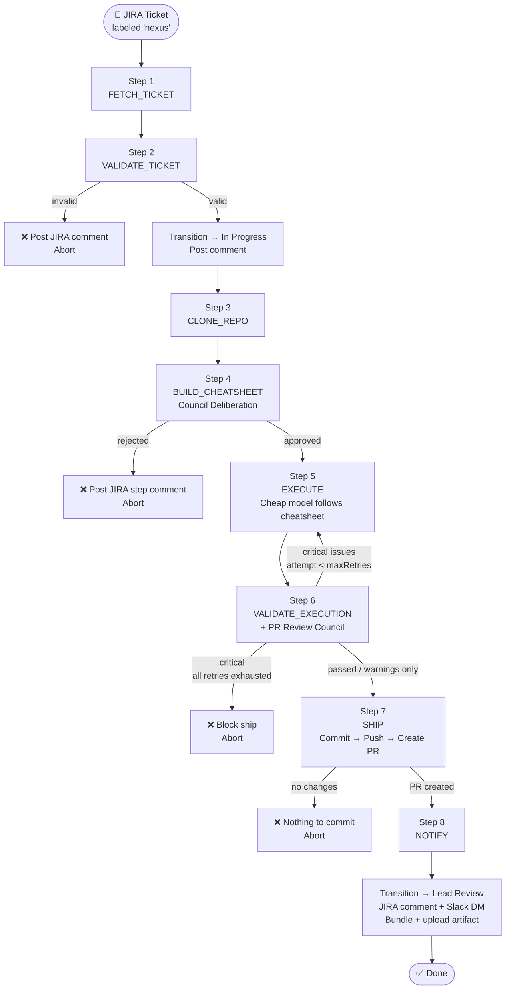
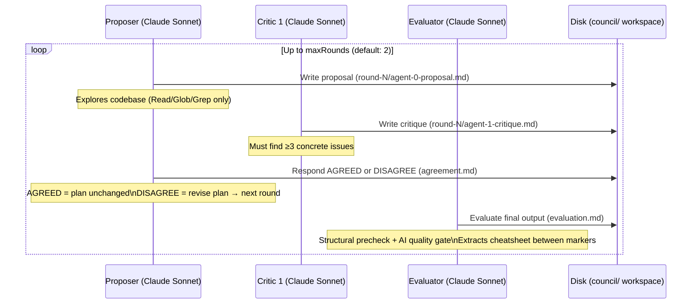

# Dr. Nexus — End-to-End Flow

> How a JIRA ticket becomes a draft PR, autonomously.

---

## 🗺️ High-Level Overview



---

## 🔄 Entry Points

| Command | What happens |
|---|---|
| `node src/index.js daemon` | Poll JIRA every 300s, process up to `maxTicketsPerCycle` tickets |
| `node src/index.js single JCP-123` | Process one specific ticket immediately |
| `node src/index.js dry-run` | Show what tickets would be picked up — no execution |
| `node src/index.js resume JCP-123 --from-step=5` | Resume a failed run from a checkpoint |

---

## 📋 Step-by-Step Detail

### Step 1 — FETCH_TICKET
```
JIRA REST API (read-only)
  └── getTicketDetails()  →  raw ADF ticket
  └── parseTicket()       →  structured object: summary, description, affectedSystems, targetBranch, fixVersions
  └── saveCheckpoint()    →  .pipeline-state/JCP-123/state.json
```

**Outputs:** Parsed ticket object with all fields normalized.

---

### Step 2 — VALIDATE_TICKET
```
validateTicket()  checks:
  - affectedSystems present + known service in config.services
  - targetBranch resolvable
  - summary non-empty
  - Required JIRA fields (customfield_10056, fixVersions)

If invalid → post JIRA comment → abort (no AI called yet)
If valid   → transitionToInProgress() + postInProgressComment() [both non-blocking]
```

> Both the JIRA status transition and the comment are fired independently — if one fails, the other still runs.

---

### Step 3 — CLONE_REPO

```
git clone --depth=50 <repoUrl> .tmp/agent-<uuid>/
git checkout -b feature/JCP-123-<sanitized-summary>

Injects agent rules:
  - Looks for CLAUDE.md / CODEX.md / codex.md in the cloned repo
  - Prepends agent-rules-with-tests.md (or -no-tests.md) based on config.tests.enabled
  - Original file is restored before commit (injected rules never reach remote)
```

**Feature branch naming:**
- Single fix-version: `feature/JCP-123-fix-login-bug`
- Multi fix-version: `feature/JCP-123-fix-login-bug-v2.5`

---

### Step 4 — BUILD_CHEATSHEET (Council Deliberation)

This is the most expensive and important step. Expensive models think deeply so the cheap executor doesn't have to.



**Failure modes:**
- Critic fails → skipped (proposer continues)
- Zero critics → use proposer output directly
- Proposer fails → abort branch
- Max rounds exceeded → force-evaluate last output

**Output:** `cheatsheet.md` — a deterministic, step-by-step implementation plan. Persisted to checkpoint so retries skip this step.

---

### Step 5 — EXECUTE (with retries)

```
Agent (deliberately dumb executor):
  - Model: Claude Sonnet (or Codex as fallback via API key)
  - Tools: Read, Write, Edit, Bash, Glob, Grep
  - Input: static system prompt + cheatsheet + guardrails

AI Provider flow (strategy: fallback):
  ┌─────────────────────────────────────────┐
  │  Claude (primary) runs first            │
  │  If: exit≠0 OR rate-limited OR garbage  │
  │     └── Codex (fallback) via API key    │
  │          OPENAI_API_KEY injected as env  │
  │          No OAuth, no browser login      │
  └─────────────────────────────────────────┘

maxRetries = config.agent.executionRetries (default: 3)
On critical validation failure → retry with feedback injected into prompt
```

**Rate-limit triggers (auto-fallback to Codex):**
- `"You've hit your limit"` / `"resets "`
- `rate_limit_exceeded` / `429` / `Too Many Requests`
- `context_length_exceeded`
- Empty / garbage output (< 10 chars)

---

### Step 6 — VALIDATE_EXECUTION

Two layers of review:

```
Layer 1: Structural validation (no AI, fast)
  validateExecution()
  - Min diff length check
  - No empty diff (nothing changed)
  - File paths referenced in cheatsheet actually exist
  - No missing test files (if tests enabled)
  - No broken imports (grep-based)
  - No TODO/FIXME/debug logs left

Layer 2: Structural diff review
  reviewDiff()
  - Reads working-tree diff vs base branch
  - Fast static checks on the diff shape

Layer 3: PR Review Council (AI, independent from cheatsheet council)
  reviewPullRequest()
  - Proposer reads diff + ticket context → proposes a verdict
  - Critics independently verify findings
  - Evaluator extracts: status (approved/rejected), warnings[], critical[]
```

**Critical issues → retry execution** (up to maxRetries).
**Warnings only → carry into PR description**, don't block.

---

### Step 7 — SHIP

```
git add -A
git commit -m "feat(JCP-123): <summary>"
git push origin feature/JCP-123-...   (force-push on branch conflict)

Optional: Base image tag
  - Auto-detected from Dockerfile
  - Only if package.json or package-lock.json changed
  - Creates tag: deploy.base.vMAJOR-MINOR-PATCH-BUILD

az repos pr create
  - Title: JCP-123: <summary>
  - Description: 2000-char approach + file changes + warnings
  - If PR already exists (TF401179) → update existing
```

---

### Step 8 — NOTIFY

```
1. Bundle artifact:
   .pipeline-state/JCP-123/ → .tar.gz → upload to Pixelbin CDN
   Returns public URL (included in all messages)

2. JIRA transition → Lead Review (non-blocking)

3. JIRA comment (always posted even if transition fails):
   - PR link
   - 200-char summary
   - "Full report" CDN link

4. Slack DM:
   - PR link + summary + report URL
   - Designed to be read in 5 seconds

5. Label updates:
   - Remove trigger label ("nexus")
   - Add done label ("nexus-done" or "nexus-done-v2.5" for versioned)
```

---

## 📁 Artifact Filesystem

```
.pipeline-state/JCP-123/
├── state.json                    ← Checkpoint (resume support)
├── cheatsheet.md                 ← Persisted plan (survives retries)
├── ai-calls/
│   ├── council-r1-agent-0.log   ← Full proposer prompt + output
│   ├── council-r1-agent-1.log   ← Full critic prompt + output
│   ├── evaluator-0.log
│   └── execute-attempt-1.log
├── council/
│   ├── status.md
│   ├── round-1/
│   │   ├── agent-0-proposal.md
│   │   ├── agent-1-critique.md
│   │   ├── agreement.md
│   │   └── evaluation.md
│   └── human-feedback.md        ← Inject mid-council to steer agent
└── pr-review/
    └── council/                  ← Independent PR review debate
        ├── round-1/
        └── status.md
```

All files are bundled into a `.tar.gz` and uploaded at end of run. URL appears in JIRA + Slack.

---

## 🤖 AI Provider Architecture

```
runAI() — single entry point for all AI calls
  │
  ├── strategy: fallback
  │     Primary:  Claude (Sonnet/Haiku)
  │     Fallback: Codex  (via OPENAI_API_KEY, no OAuth)
  │
  ├── mode: execute  → tools: Read,Write,Edit,Bash,Glob,Grep  → cheap model
  ├── mode: debate   → tools: Read,Glob,Grep (read-only)      → expensive model
  └── mode: evaluate → tools: Read,Glob,Grep                  → expensive model

Council agents maintain session memory across rounds (--resume session_id)
so they don't re-read the codebase each round.
```

---

## 🔁 Resume Flow

If a run fails mid-way, resume from the last successful checkpoint:

```bash
node src/index.js resume JCP-123 --from-step=5
```

| Resume from | What re-runs |
|---|---|
| Step 3 | Clone → Cheatsheet → Execute → Validate → Ship → Notify |
| Step 5 | Execute → Validate → Ship → Notify (uses saved cheatsheet) |
| Step 7 | Ship → Notify (skips all AI calls) |
| Step 8 | Notify only |

> Step 3 (clone) always re-runs — the `.tmp/` directory is cleaned up after each run.
